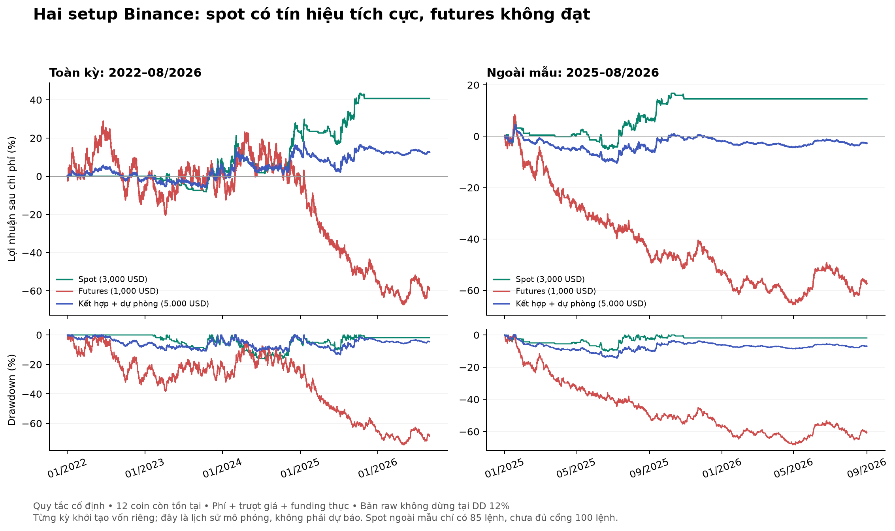

# Hai setup Binance — kết quả kiểm thử và kế hoạch sử dụng

Tạo lúc 2026-09-06T23:44:22.079315+00:00. Vốn mô phỏng 5.000 USD = spot 3.000 + futures 1.000 + dự phòng 1.000.

**Kết luận kiểm định:** spot: **FAILED**; futures: **FAILED**.

PASS chỉ đủ điều kiện forward test vốn nhỏ, không đồng nghĩa bảo đảm có lợi nhuận. FAILED nghĩa là không đề xuất dùng setup đó để giao dịch tiền thật theo cấu hình này.

## Quy tắc đã chốt trước kết quả

**Spot D1/H4 breakout:** D1 giá > EMA50 > EMA200, BTC D1 trên EMA200; altcoin ROC20 ngày mạnh hơn BTC. Trung vị turnover30 ngày ≥ 10 triệu USDT. H4 đóng vượt đỉnh20 nến trước với điều kiện lần đầu vượt; giá trên EMA20. Mua tại mở H4 kế tiếp. Stop2ATR14, target3R, tối đa90 nến H4. BTC được miễn điều kiện tự so sánh ROC.

**Futures H4/H1 pullback:** H4 giá > EMA50 > EMA200 và EMA50 đang tăng so với3 nến trước để long; short đảo ngược. H1 trước chạm EMA20 nhưng đóng phía thuận của EMA50, H1 hiện tại đóng vượt đỉnh/đáy nến trước và EMA20/50 thuận hướng. Trung vị turnover30 ngày ≥ 20 triệu USDT. Vào mở H1 kế tiếp. Stop2ATR14, target3R, tối đa72 nến H1.

Cả hai dùng HTF đã đóng và đã biết tại **mở nến tín hiệu**. Không trailing, không nhồi lệnh, không đổi stop sau vào. Thoát thời gian tại mở nến sau khi đủ thời hạn. Đây là hai giả thuyết giao dịch, không phải kết quả backtest của SMC/ICT tùy ý.

## Kết quả ngoài mẫu 01/01/2025–31/08/2026

| setup | trades | return_pct | net_pnl | profit_factor | win_rate_pct | mean_r | max_drawdown_pct | fees | funding |
|---|---|---|---|---|---|---|---|---|---|
| spot | 85 | 14.55 | 436.35 | 1.41 | 35.29 | 0.26 | 10.20 | 96.04 | 0.00 |
| futures | 464 | -57.25 | -572.46 | 0.76 | 26.94 | -0.13 | 68.30 | 161.85 | 10.45 |

Return và drawdown của từng setup tính trên **vốn riêng của setup**; không tính trên tổng 5.000 USD. R dùng số tiền lỗ dự kiến tại stop có phí, có thể khác giữa các lệnh do trần vị thế. Funding dương là chi phí, âm là thu nhập.

## Tài khoản kết hợp và đối chứng

| period | end_equity | return_pct | max_drawdown_pct |
|---|---|---|---|
| development | 5186.53 | 3.73 | 11.04 |
| validation | 5427.94 | 8.56 | 11.98 |
| holdout | 4863.89 | -2.72 | 14.36 |
| full | 5629.69 | 12.59 | 13.42 |

Đối chứng 60% vốn mua giữ BTC spot +40% tiền mặt, có chi phí mua/bán:

| period | end_equity | return_pct | max_drawdown_pct |
|---|---|---|---|
| development | 4736.46 | -5.27 | 40.90 |
| validation | 8619.29 | 72.39 | 21.67 |
| holdout | 4511.73 | -9.77 | 35.67 |
| full | 7085.53 | 41.71 | 42.89 |

Các giai đoạn độc lập đều khởi đầu 5.000 USD và không có vị thế. Dòng full là một mô phỏng liên tục riêng. Đường equity spot chỉ cập nhật H4, futures H1; equity kết hợp không phản ánh biến động spot bên trong H4.

## Phân tách thời gian và chi phí tăng gấp đôi

| setup | period | trades | return_pct | profit_factor | max_drawdown_pct | max_losing_streak | longest_underwater_days |
|---|---|---|---|---|---|---|---|
| spot | development | 77 | 5.67 | 1.16 | 9.29 | 8 | 201.33 |
| spot | validation | 101 | 16.29 | 1.37 | 16.34 | 10 | 271.17 |
| spot | holdout | 85 | 14.55 | 1.41 | 10.20 | 12 | 322.67 |
| spot | full | 263 | 40.76 | 1.33 | 16.34 | 12 | 322.67 |
| spot | stress_holdout | 85 | 9.56 | 1.27 | 10.75 | 12 | 322.67 |
| spot | guarded_full | 125 | 5.44 | 1.10 | 12.25 | 11 | 909.33 |
| futures | development | 497 | 1.65 | 1.00 | 38.35 | 17 | 561.12 |
| futures | validation | 279 | -6.08 | 0.97 | 22.92 | 11 | 261.50 |
| futures | holdout | 464 | -57.25 | 0.76 | 68.30 | 16 | 591.12 |
| futures | full | 1239 | -59.31 | 0.93 | 74.63 | 17 | 1535.12 |
| futures | stress_holdout | 461 | -75.70 | 0.63 | 78.83 | 16 | 591.12 |
| futures | guarded_full | 135 | 9.01 | 1.09 | 12.21 | 12 | 1535.12 |

development=2022–2023; validation=2024; holdout=2025–08/2026. stress_holdout tăng gấp đôi cả phí và trượt giá, funding giữ thực tế. guarded_full bật giảm nửa rủi ro khi drawdown vốn setup 8%, dừng mở mới từ 12%; sau dừng không tự hồi phục. Bản raw vẫn chạy để nhìn thấy rủi ro nguyên gốc.

## Tiêu chí chấp nhận đã định trước

Ngoài mẫu: lãi ròng>0, profit factor≥ 1,15, ít nhất 100 lệnh, drawdown equity≤ 15%, stress chi phí vẫn lãi; thêm không có lỗi đối soát, thiếu dữ liệu vị thế hoặc cảnh báo thanh lý chưa mô hình được.

- **spot: FAILED** — sample_100
- **futures: FAILED** — net_profit, profit_factor, drawdown_15, double_cost_profit

## Kiểm tra độ bền

Đã chạy lưới stop ATR 1,5/2/2,5 × target 2R/3R/4R **chỉ trên development và validation**; không chọn lại thông số mặc định từ ngoài mẫu. Xem sensitivity.csv. Yearly.csv kiểm tra từng năm độc lập với quy tắc giữ nguyên, không phải walk-forward có tối ưu tham số.

| setup | block_days | samples | return_pct_p05 | return_pct_p95 |
|---|---|---|---|---|
| spot | 7 | 2000 | -7.08 | 42.63 |
| futures | 7 | 2000 | -78.97 | -11.97 |

Khoảng trên lấy mẫu lại lợi nhuận ngày theo khối 7 ngày, 2.000 lần với seed cố định; chỉ mô tả bất định trong mẫu đã quan sát. Không thể coi là xác suất thắng trong tương lai hoặc loại bỏ thiên lệch chọn coin.

## Vốn và giới hạn vị thế

Spot rủi ro cơ sở 20 USD/lệnh trên vốn 3.000; futures 12,50 USD/lệnh trên vốn 1.000, tăng/giảm theo equity từng phần. Trần rủi ro ban đầu các vị thế của mỗi phần 2% equity. Spot tối đa 4 vị thế, mỗi vị thế≤25% vốn spot; futures tối đa 2, mỗi vị thế≤100% vốn futures, tổng notional≤2×, ký quỹ giả định3×. Do trần2%, futures thường chỉ có1 vị thế với mức risk đầy đủ. Không chuyển tiền dự phòng để bù lỗ.

Không thể diễn giải ngưỡng drawdown 40% của bạn là lý do tăng đòn bẩy hoặc tăng rủi ro trước khi có lợi thế được kiểm chứng.

## Giả định khớp lệnh và giới hạn dữ liệu

- 12 cặp cố định: BTCUSDT, ETHUSDT, BNBUSDT, XRPUSDT, ADAUSDT, DOGEUSDT, LINKUSDT, LTCUSDT, BCHUSDT, DOTUSDT, UNIUSDT, SOLUSDT. Đây là **survivor cohort**, chưa kiểm thử đầy đủ các coin đã hủy niêm yết hoặc top200/top100 tại từng ngày lịch sử.
- Binance có 5 nến spot H4 với close_time rút ngắn trong 2021 trên mỗi cặp, được giữ nguyên và ghi cảnh báo trong manifest. Chúng chỉ thuộc giai đoạn khởi tạo chỉ báo; giai đoạn giao dịch 2022 trở đi phải đủ nến tiêu chuẩn.
- Dữ liệu spot H4, futures H1, funding và mark H1 từ API công khai Binance; thời gian yêu cầu 2021-01-01 đến2026-09-01 exclusive. manifest.json lưu thời gian tải, số dòng, thiếu nến, SHA256. Dữ liệu có thể được sàn sửa về sau.
- Phí giả định mỗi chiều: spot 10 bps, futures 5 bps; trượt giá mỗi chiều: spot 5 bps, futures 3 bps. Không khẳng định đây là bậc phí tài khoản bạn; không giả định được khớp maker.
- Khi nến chạm cả stop và target: stop trước. Gap qua stop: lấy giá mở bất lợi. Target áp dụng trượt giá như lệnh thị trường. Chưa dùng tick/orderbook hoặc Bar Magnifier, có thể sai lệch so với đường giá thực.
- Funding theo từng sự kiện thực. Có markPrice sự kiện thì dùng; nếu thiếu dùng mark OPEN H1 chứa sự kiện, cuối cùng contract open. Funding trong giờ được gán cho vị thế có khả năng chịu sự kiện; việc thoát bên trong giờ không xác định chính xác. Funding credit vẫn được ghi đúng dấu, đây là xấp xỉ thời điểm.
- Mark H1 được dùng rà soát vùng nguy cơ thanh lý với maintenance buffer 1%; chưa mô phỏng chính xác historical risk tier, liquidation fee hay insurance engine. Nếu có cảnh báo, kết quả không được thông qua tự động.
- Historical LOT_SIZE/tick size/minNotional không có lịch sử đầy đủ. Backtest dùng lượng liên tục và ngưỡng notional 10 USDT; scanner làm tròn theo filter hiện tại. Khoản vốn thực nhỏ có thể gặp sai khác rounding.
- Equity được đánh dấu theo nến, có cả drawdown bất lợi theo cực trị nến trong metrics.json; cực trị nhiều coin có thể không đồng thời, và chưa cắt theo thời điểm stop nên chỉ là stress upper estimate.
- Narrative do người dùng gắn nhãn trong cấu hình; không giả định đã có dữ liệu narrative point-in-time. Danh sách live mở rộng ngoài 12 cặp phải forward test riêng.

## Sử dụng bộ lọc và TradingView

Đọc ../SCANNER_VI.md để quét top100 thanh khoản hiện tại và xuất watchlist. Báo cáo ngày là danh sách quan sát; tín hiệu đã qua giá mở nến kế tiếp được đánh dấu hết thời điểm vào theo backtest. Dùng Pine theo từng nến đóng để theo dõi trigger H1/H4.

Mã Pine nằm ở ../tradingview/. Python là nguồn kiểm thử danh mục. Pine không tái tạo được funding thực, turnover chính xác, xếp hạng toàn thị trường, giới hạn vốn giữa các chart hay toàn bộ giả định khớp lệnh. Trạng thái kiểm tra compiler ghi trong README TradingView.

## Tệp kiểm toán

metrics.json: toàn bộ metrics + audit. trades_*.csv: mọi lệnh. equity_*.csv: equity theo nến. by_symbol.csv, by_direction.csv, yearly.csv: phân rã. sensitivity.csv: lưới ngoài holdout. data/manifest.json: nguồn và tính toàn vẹn dữ liệu. SPEC.md: quy tắc đóng băng trước chạy.

## Nguồn chính thức

- [Binance market data và funding](https://developers.binance.com/en/docs/catalog/core-trading-derivatives-trading-usd-s-m-futures/api/rest-api/market-data)
- [Binance public data](https://github.com/binance/binance-public-data)
- [TradingView: mô hình strategy và broker emulator](https://www.tradingview.com/pine-script-docs/concepts/strategies/)
- [TradingView: dữ liệu đa khung và tránh dùng tương lai](https://www.tradingview.com/pine-script-docs/concepts/other-timeframes-and-data/)
